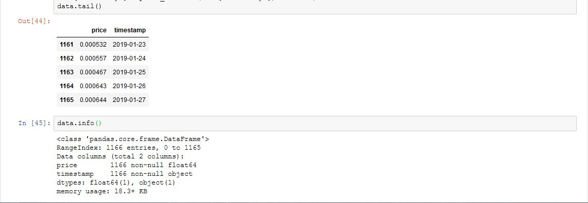
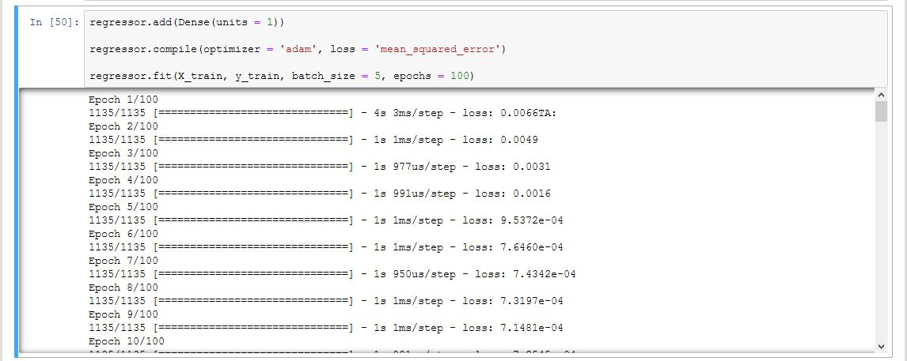
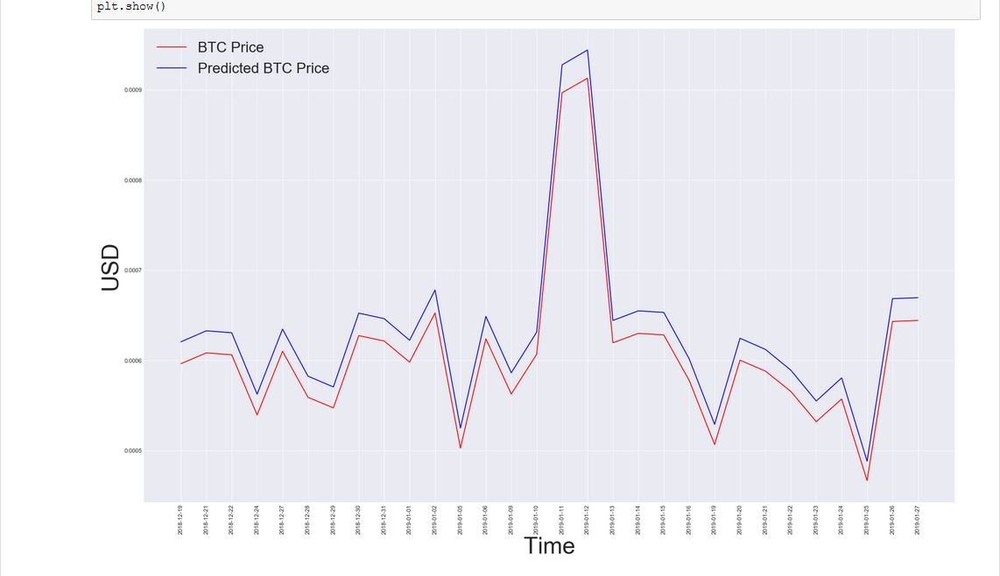

# Multi-step-Time-Series-Prediction-of-Bitcoin-
## Jupyter Notebook

### Using Keras over tensorflow

  --> Adam Optimizer
  --> No. of steps 100
  --> batchSize 5

/////////////////////////////////////////////////////////////////////////////////////////////////////////////////////////////////////////

////////////////////////////////////////////////////////////////////////////////////////////////////////////////////////////////////////

